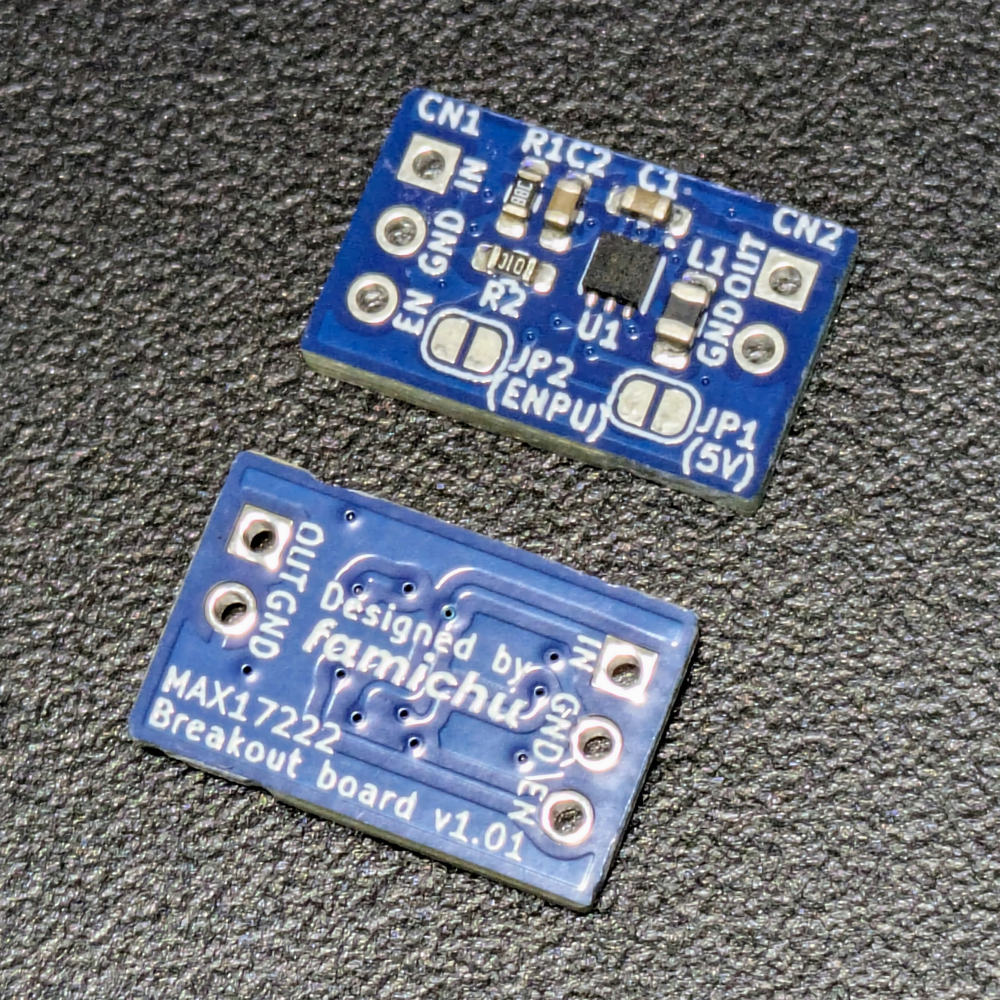
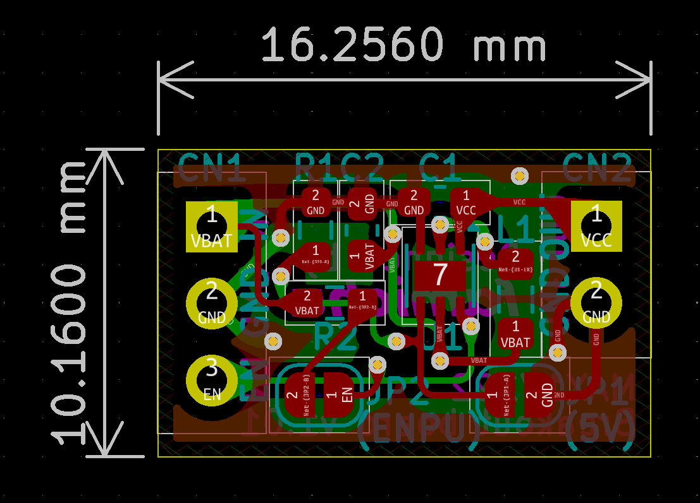

# 概要
AnalogDevices社のMAX17222という昇圧ICの評価基板です。
回路の構成は該当ICののデータシートに記載されているリファレンス回路ほぼそのままです。

# 特徴
以下はMAX17222の特徴です。
- 0.8V～出力電圧未満までの入力電圧に対応
- トゥルーシャットダウン機能搭載

以下は本基板の特徴です。
- ブレッドボードで使用可能な2.54mmピッチ
- 出力電圧切替ジャンパ搭載(3.3V/5V)
- Enableピンプルアップジャンパ搭載
- LCSCの部品番号登録済み(JLCPCBでのPCBAが楽)

# サイズ
幅約16.3 x 高さ約10.2 x 厚み約2.5mm

# 注意点
- 最大出力電流は入力電圧と出力電圧の比率に依存します。
構成上の出力上限は3.3V時で250mA、5V時で160mAですが、入力電圧と出力電圧の組み合わせによってはより低くなります。詳しくはMAX17222のデータシートをご確認ください。

- 本製品はICが最低限動作可能な部品のみで構成された基板です。
過負荷、過電圧、過電流、逆電流、温度などの保護素子は一切入っておりません。ご利用の際は搭載ICのデータシートをご一読の上、細心の注意を払ってご利用ください。